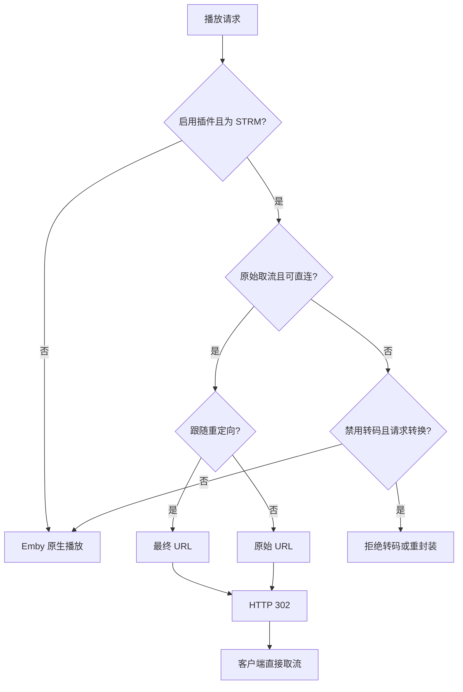

# StrmDirect

将符合条件的 STRM 播放请求重定向至原始地址

```mermaid
flowchart TD
    A[播放请求] --> B{启用插件且为 STRM?}
    B -->|否| N[Emby 原生播放]
    B -->|是| C{原始取流且可直连?}
    C -->|是| D{跟随重定向?}
    D -->|是| E[最终 URL]
    D -->|否| F[原始 URL]
    E --> G[HTTP 302]
    F --> G
    G --> H[客户端直接取流]
    C -->|否| I{禁用转码且请求转换?}
    I -->|否| N
    I -->|是| J[拒绝转码或重封装]
```

---

## 许可证

[GPL-3.0](LICENSE)。上游归属信息见 [THIRD-PARTY-NOTICES](THIRD-PARTY-NOTICES.txt)。
